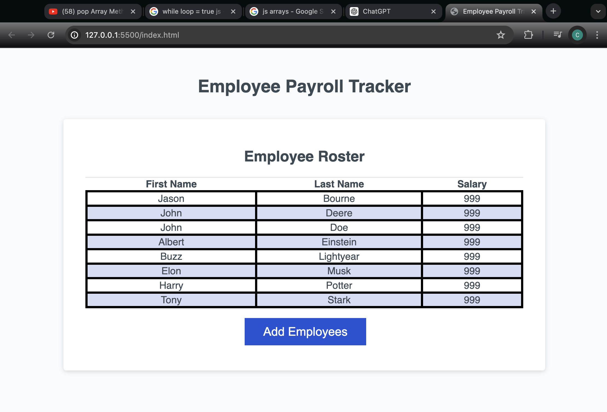

# Payroll-Tracker

## Description

This Employee payroll tracker was created to demonstrate the usage of javascript logic. A user should be able to input data via the "add employees" button. They will then be prompted to iniput a first name, last name, then salary. finally they will be given the option to add a new employee or exit the promt. 

Once all new employees have been added, they wil display in a table alphabetically by last name and inside the console log the average salary will be displayed along with the details of a randomly chosen employee. 

## Installation

n/a

## Usage

## License

MIT License
please refer to license file within repo
---